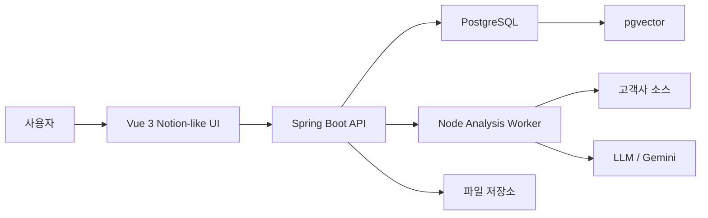

# Azbrain 제품 전환 설계

## 목표

eCAMS AI를 고객사 소스 분석 도구에서 **Azbrain**이라는 유지보수 지식관리 시스템으로 확장한다.

Azbrain은 고객사별 유지보수 기록, 회의록, 장애 이력, 수정 내역, 소스 분석, 특이사항, 접속 정보, 담당자 변경 이력까지 한 곳에 저장하고 AI가 자동으로 분류, 요약, 검색, 답변하는 시스템이다.

## 제품 한 줄 정의

Azbrain은 오래된 유지보수 지식과 고객사별 히스토리를 노션처럼 정리하고, AI가 필요한 순간 찾아주는 사내 유지보수 지식 OS다.

## 왜 필요한가

- 회사 유지보수 기간이 길어지며 고객사별 맥락이 사람 기억에 흩어져 있다.
- 담당자가 바뀌면 과거 수정 이유, 장애 원인, 고객사 특이사항을 다시 추적해야 한다.
- 소스 변경은 남아도 왜 바꿨는지, 어떤 회의나 이슈에서 나온 결정인지 연결되지 않는다.
- 작은 운영 정보, 예를 들면 특정 유지보수 PC의 로컬 비밀번호나 접속 위치 같은 지식도 사라지기 쉽다.
- 지금의 eCAMS AI는 소스 업로드, 분석, 답변, 오류 원인 확인에 강하지만 지식 축적과 히스토리 관리 제품은 아니다.

## 핵심 방향

- UI는 노션처럼 문서, 고객사, 이슈, 코드, 대화를 자연스럽게 오가는 형태로 개편한다.
- 프론트엔드는 Vue 3로 새로 구성한다.
- 백엔드는 Spring Boot와 PostgreSQL을 중심으로 업무 데이터와 지식 데이터를 관리한다.
- 기존 Node 분석 엔진은 1차에서 버리지 않고 분석 worker로 유지한다.
- PostgreSQL에는 pgvector를 붙여 지식 검색과 자동 분류의 기반으로 삼는다.

## 권장 아키텍처

## 주요 사용자 경험

- 고객사를 선택하면 해당 고객사의 유지보수 홈이 열린다.
- 홈에는 최근 이슈, 회의록, 작업 기록, 관련 소스 변경, 접속 정보, 담당자 메모가 시간순과 주제별로 보인다.
- 사용자는 노션처럼 페이지를 만들고 블록 단위로 내용을 적는다.
- AI는 입력된 글, 첨부 파일, 대화, 소스 분석 결과를 자동 태깅한다.
- 나중에 “작년에 A사이트 로그인 오류 왜 났지?”처럼 물으면 관련 이슈, 회의록, 수정 파일, 답변 기록을 찾아준다.
- 채팅에서 나온 중요한 답변은 자동으로 지식 페이지 또는 고객사 히스토리로 저장 후보가 된다.

## 정보 구조

- 고객사 Workspace.
- 프로젝트 또는 시스템.
- 유지보수 페이지.
- 이슈와 장애.
- 회의록.
- 작업 기록.
- 코드 분석 결과.
- 접속 정보와 운영 메모.
- AI 대화 히스토리.
- 결정 기록.

## 1차 기능 범위

- Azbrain 이름과 제품 구조 확정.
- Vue 3 기반 좌측 사이드바, 고객사 워크스페이스, 문서 리스트, 본문 영역 설계.
- Spring Boot, PostgreSQL, pgvector 기반 데이터 모델 설계.
- 기존 사용자, 회사, 레포 권한 데이터를 PostgreSQL로 이전.
- 채팅 히스토리를 고객사, 이슈, 소스와 연결 가능한 구조로 저장.
- AI 답변 중 저장할 만한 내용을 지식 후보로 만드는 기능.
- 고객사별 검색과 AI 질의응답.

## 2차 기능 범위

- 노션형 블록 에디터 도입.
- 회의록 자동 요약과 액션 아이템 추출.
- 소스 변경과 유지보수 기록 연결.
- 장애 이슈 타임라인.
- 민감 정보 접근 권한과 감사 로그.
- 고객사별 운영 지식 자동 분류.

## 기술 선택 초안

- Frontend: Vue 3, Vite, TypeScript, Pinia, Vue Router.
- Editor: Tiptap 또는 Milkdown 검토. 1차는 단순 Markdown/블록 혼합도 가능.
- Backend: Spring Boot 3, Java 21, Spring Security, Spring Data JPA.
- Database: PostgreSQL, pgvector, Flyway.
- Search: PostgreSQL full-text search + pgvector hybrid search.
- Analysis Worker: 기존 Node 분석 모듈 유지.
- Deployment: Docker Compose에서 Vue 빌드, Spring Boot, PostgreSQL, Node worker 분리.

## 데이터 모델 큰 틀

- `organizations` 또는 `companies`: 고객사.
- `workspaces`: 고객사별 지식 공간.
- `pages`: 노션형 문서.
- `page_blocks`: 문서 블록.
- `issues`: 장애와 유지보수 이슈.
- `maintenance_logs`: 작업 기록.
- `meetings`: 회의록.
- `knowledge_items`: AI가 분류한 지식 단위.
- `chat_sessions`, `chat_messages`: AI 대화 히스토리.
- `source_repositories`: 고객사 소스 저장소.
- `source_changes`: 소스 변경 기록.
- `secrets`: 접속 정보와 민감 정보. 암호화 필수.
- `embeddings`: 검색용 벡터.
- `audit_logs`: 민감 정보 조회와 변경 감사.

## 민감 정보 원칙

- 로컬 PC 비밀번호, 서버 접속 정보, 고객사 특이 보안 정보는 일반 문서와 분리한다.
- DB 저장 시 필드 단위 암호화를 적용한다.
- 조회 권한과 조회 로그를 반드시 둔다.
- AI 답변에 민감 정보가 노출될 때는 권한을 확인하고 근거를 남긴다.

## 단계별 전환

1. Azbrain 제품 설계와 화면 정보 구조 확정.
2. PostgreSQL 스키마와 기존 JSON 데이터 이전 설계.
3. Spring Boot 인증, 사용자, 고객사, 권한 API 구현.
4. Vue 3 Azbrain UI 골격 구현.
5. 문서, 히스토리, 채팅 저장 구조 구현.
6. pgvector 기반 지식 검색 구현.
7. 기존 Node 분석 엔진을 worker로 연결.
8. 노션형 블록 에디터와 자동 분류 기능 고도화.

## 예상 기간

- 제품 설계와 DB 설계: 2일에서 4일.
- Spring Boot, PostgreSQL 기반 1차 백엔드: 1주에서 2주.
- Vue 3 노션형 UI 1차: 1주에서 2주.
- AI 자동 분류, 검색, 기존 분석 엔진 연결: 1주에서 2주.
- 실사용 가능한 1차 Azbrain은 4주에서 6주 정도가 현실적이다.

## 중요한 결정

처음부터 완전한 노션을 만들면 오래 걸린다. 1차는 “고객사 워크스페이스 + 히스토리 페이지 + AI 검색”에 집중하고, 블록 에디터는 점진적으로 키우는 방향이 좋다.
