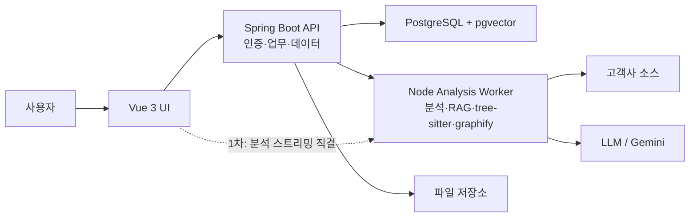

# Azbrain 제품 전환 설계

## 목표

eCAMS AI를 고객사 소스 분석 도구에서 **Azbrain**이라는 유지보수 지식관리 시스템으로 확장한다.

Azbrain은 고객사별 유지보수 기록, 회의록, 장애 이력, 수정 내역, 소스 분석, 특이사항, 접속 정보, 담당자 변경 이력까지 한 곳에 저장하고 AI가 자동으로 분류, 요약, 검색, 답변하는 시스템이다.

## 제품 한 줄 정의

Azbrain은 오래된 유지보수 지식과 고객사별 히스토리를 노션처럼 정리하고, AI가 필요한 순간 찾아주는 사내 유지보수 지식 OS다.

## 왜 필요한가

- 회사 유지보수 기간이 길어지며 고객사별 맥락이 사람 기억에 흩어져 있다.
- 담당자가 바뀌면 과거 수정 이유, 장애 원인, 고객사 특이사항을 다시 추적해야 한다.
- 소스 변경은 남아도 왜 바꿨는지, 어떤 회의나 이슈에서 나온 결정인지 연결되지 않는다.
- 작은 운영 정보, 예를 들면 특정 유지보수 PC의 로컬 비밀번호나 접속 위치 같은 지식도 사라지기 쉽다.
- 지금의 eCAMS AI는 소스 업로드, 분석, 답변, 오류 원인 확인에 강하지만 지식 축적과 히스토리 관리 제품은 아니다.

## 핵심 방향

- UI는 노션처럼 문서, 고객사, 이슈, 코드, 대화를 자연스럽게 오가는 형태로 개편한다.
- 프론트엔드는 Vue 3로 새로 구성한다.
- 백엔드는 Spring Boot와 PostgreSQL을 중심으로 업무 데이터와 지식 데이터를 관리한다.
- 기존 Node 분석 엔진은 1차에서 버리지 않고 분석 worker로 유지한다.
- PostgreSQL에는 pgvector를 붙여 지식 검색과 자동 분류의 기반으로 삼는다.

## 전환 전략

회사에서 Node.js를 금지한 것은 아니다. 다만 신규 제품들이 Vue 3 + Spring Boot + PostgreSQL 스택으로 만들어지고 있으므로, 기존 시스템도 같은 스택으로 정렬해서 코드 일관성을 확보한다.

Node 엔진(wikiBuilder, graphifyBuilder, contextBuilder, tree-sitter, graphify 등)을 Java로 통째 포팅하면 수 개월짜리 고위험 작업이고 새 가치는 없다. 특히 graphify는 자체 npm 패키지 + graphology 생태계라 Java 대응물이 없고, tree-sitter Java 바인딩도 미성숙하다.

따라서 **strangler-fig 패턴**으로 점진 전환한다.

- Spring Boot가 정문 역할(인증, 업무 로직, 데이터 소유)을 맡는다.
- Node 엔진은 내부 분석 서비스(worker)로 유지하되, 엔드포인트를 하나씩 Spring Boot로 이관한다.
- Vue 3가 기존 public/index.html(272KB 모놀리식 HTML)을 대체한다.

### 스트리밍 홉 문제

현재는 브라우저 → Node → Gemini 직결 스트리밍이다. 하이브리드 전환 후 선택지가 둘 있다.

- (A) Vue → Spring Boot → Node → Gemini. 홉 추가, 지연 증가.
- (B) 분석/스트리밍만 Vue ↔ Node 직결, 나머지는 Spring Boot 경유.

1차에서는 (B)를 채택한다. 다만 브라우저가 Node 포트를 직접 알 필요는 없도록 nginx 또는 Spring 프록시로 경로를 숨긴다. Node 엔드포인트 이관이 끝나면 자연스럽게 (A)로 수렴한다.

## 권장 아키텍처

## 주요 사용자 경험

- 고객사를 선택하면 해당 고객사의 유지보수 홈이 열린다.
- 홈에는 최근 이슈, 회의록, 작업 기록, 관련 소스 변경, 접속 정보, 담당자 메모가 시간순과 주제별로 보인다.
- 사용자는 노션처럼 페이지를 만들고 블록 단위로 내용을 적는다.
- AI는 입력된 글, 첨부 파일, 대화, 소스 분석 결과를 자동 태깅한다.
- 나중에 “작년에 A사이트 로그인 오류 왜 났지?”처럼 물으면 관련 이슈, 회의록, 수정 파일, 답변 기록을 찾아준다.
- 채팅에서 나온 중요한 답변은 자동으로 지식 페이지 또는 고객사 히스토리로 저장 후보가 된다.

## 정보 구조

- 고객사 Workspace.
- 프로젝트 또는 시스템.
- 유지보수 페이지.
- 이슈와 장애.
- 회의록.
- 작업 기록.
- 코드 분석 결과.
- 접속 정보와 운영 메모.
- AI 대화 히스토리.
- 결정 기록.

## 1차 기능 범위

- Azbrain 이름과 제품 구조 확정.
- Vue 3 기반 좌측 사이드바, 고객사 워크스페이스, 문서 리스트, 본문 영역 설계.
- Spring Boot, PostgreSQL, pgvector 기반 데이터 모델 설계.
- 기존 사용자, 회사, 레포 권한 데이터를 PostgreSQL로 이전.
- 채팅 히스토리를 고객사, 이슈, 소스와 연결 가능한 구조로 저장.
- AI 답변 중 저장할 만한 내용을 지식 후보로 만드는 기능.
- 고객사별 검색과 AI 질의응답.

## 2차 기능 범위

- 노션형 블록 에디터 도입.
- 회의록 자동 요약과 액션 아이템 추출.
- 소스 변경과 유지보수 기록 연결.
- 장애 이슈 타임라인.
- 민감 정보 접근 권한과 감사 로그.
- 고객사별 운영 지식 자동 분류.

## 기술 선택 초안

- Frontend: Vue 3, Vite, TypeScript, Pinia, Vue Router.
- Editor: Tiptap 또는 Milkdown 검토. 1차는 단순 Markdown/블록 혼합도 가능.
- Backend: Spring Boot 3, Java 21, Spring Security, Spring Data JPA.
- Database: PostgreSQL, pgvector, Flyway.
- Search: PostgreSQL full-text search + pgvector hybrid search. 한국어는 기본 파서로 안 되므로 pgroonga 또는 pg_bigm 확장 검토 필요.
- Analysis Worker: 기존 Node 분석 모듈 유지.
- Deployment: Docker Compose에서 Vue 빌드, Spring Boot, PostgreSQL, Node worker 분리.

## 데이터 모델 큰 틀

- `organizations` 또는 `companies`: 고객사.
- `workspaces`: 고객사별 지식 공간.
- `pages`: 노션형 문서.
- `page_blocks`: 문서 블록.
- `issues`: 장애와 유지보수 이슈.
- `maintenance_logs`: 작업 기록.
- `meetings`: 회의록.
- `knowledge_items`: AI가 분류한 지식 단위.
- `chat_sessions`, `chat_messages`: AI 대화 히스토리.
- `source_repositories`: 고객사 소스 저장소.
- `source_changes`: 소스 변경 기록.
- `secrets`: 접속 정보와 민감 정보. 암호화 필수.
- `embeddings`: 검색용 벡터.
- `audit_logs`: 민감 정보 조회와 변경 감사.

## 기존 데이터 이전 대상

현재 시스템의 데이터를 PostgreSQL로 이전해야 한다.

| 데이터 | 현재 위치 | 이전 방식 |
|--------|----------|----------|
| 사용자 계정 | users.json | 스크립트 일괄 이전. bcrypt 해시는 jBCrypt와 호환. |
| 회사/고객사 | companies.json | 스크립트 일괄 이전. |
| 레포 설정 | repos.json | 스크립트 일괄 이전. |
| 요청사항 | requests.json | 스크립트 일괄 이전. |
| 대화 히스토리 | logs/chat_history/*.json + 클라이언트 localStorage 캐시 | 기존 서버 API는 유지하고 PostgreSQL로 저장소 이전. 파일 저장소는 fallback으로 유지. |
| 답변 캐시 | answer_cache.json | knowledge_items 테이블로 변환. |
| 지식 데이터 | knowledge/ 디렉토리 JSON 파일 | knowledge_items + embeddings 테이블로 변환. |
| 위키/인덱스 | wiki/, indexes/ 디렉토리 | 1차에서는 Node worker가 그대로 사용. Spring Boot 전환 시 DB 이전. |
| 푸시 구독 | pushSubscriptions.json | 스크립트 일괄 이전. |

## 인증 전환

현재 인증은 server.js의 bcryptjs + 메모리 세션이다. Spring Security로 전환한다.

- bcryptjs → jBCrypt. 해시 형식 호환되므로 기존 비밀번호 재설정 불필요.
- 사내 사용자는 PMS와 동일한 Google OAuth client를 사용한다. 허용 도메인은 `@azsoft.kr`로 제한한다.
- 고객사 사용자는 Google OAuth 대상이 아니므로 기존 계정 또는 별도 초대 링크 방식을 유지한다.
- API 인증은 JWT를 기본으로 검토하되, OAuth 로그인 결과를 내부 사용자 세션 또는 JWT로 연결한다.
- 프론트 인증 흐름. Vue 3에서 axios 인터셉터로 토큰 관리.

## 프론트엔드 전환

현재 public/index.html이 272KB짜리 모놀리식 HTML이다. Vue 3로 전면 재구축한다.

- CodeMirror 번들(cm.bundle.js)은 Vue 컴포넌트로 전환.
- 기존 화면의 핵심 기능(소스 업로드, 분석, 채팅, 결과 조회)은 1차에 포함.
- 노션형 블록 에디터는 2차 범위.

## 민감 정보 원칙

- 로컬 PC 비밀번호, 서버 접속 정보, 고객사 특이 보안 정보는 일반 문서와 분리한다.
- DB 저장 시 필드 단위 암호화를 적용한다.
- 조회 권한과 조회 로그를 반드시 둔다.
- AI 답변에 민감 정보가 노출될 때는 권한을 확인하고 근거를 남긴다.

## 단계별 전환

### 1단계: 대화 히스토리 PostgreSQL 이전 (가장 높은 가성비)

스택 전환 결정과 무관하게 즉시 가치가 있다. 현재 대화는 서버 API가 있지만 최종 저장소가 `logs/chat_history/*.json` 파일이므로 검색과 지식화에 한계가 있다.

- 외부 PostgreSQL 서버는 `192.168.0.21`을 사용한다.
- Node 컨테이너는 `PGHOST=192.168.0.21` 기준으로 접속한다.
- `chat_sessions`, `chat_messages` 테이블은 앱 연결 시 SQL로 보장한다.
- 기존 Node 서버의 `/api/chat/history` 계약은 유지하고 저장소만 PostgreSQL 우선으로 변경.
- DB 연결이 실패하면 기존 파일 저장소로 fallback.
- 기존 `logs/chat_history/*.json` 데이터를 PostgreSQL로 이전.
- 이 테이블이 azbrain 지식 저장소(pgvector)의 정확한 토대가 된다.

### 2단계: Spring Boot 정문 + Vue 3 UI

- Spring Boot 프로젝트 생성. Spring Security + JWT 인증.
- users.json, companies.json, repos.json → PostgreSQL 이전 스크립트.
- Vue 3 프로젝트 생성. 기존 index.html 핵심 기능(소스 업로드, 분석, 채팅, 결과 조회) 재구축.
- Spring Boot가 인증, 사용자, 고객사, 권한 CRUD를 소유.
- Node 엔진은 내부 서비스로 유지. Spring Boot ↔ Node 간 REST 연결.

### 3단계: pgvector 자동분류 · 의미검색 → Azbrain 승격

- pgvector 확장 설치. embeddings 테이블 생성.
- 수집 파이프라인. 파일 업로드(multer/officeparser) → 정규화·분류(Gemini 태깅) → 저장(Postgres + pgvector).
- 검색. 벡터 유사도 + full-text 하이브리드. 한국어는 pgroonga 또는 pg_bigm 확장 적용.
- 고객사별 워크스페이스, 히스토리 페이지, AI 질의응답 구현.
- answer_cache.json, knowledge/ 데이터를 knowledge_items 테이블로 이전.

### 4단계: 노션형 페이지 · 고도화

- Tiptap(ProseMirror 기반) Vue 3 블록 에디터 도입.
- 회의록 자동 요약, 소스 변경 연결, 장애 타임라인.
- 민감 정보 암호화 접근 권한, 감사 로그.
- 고객사별 운영 지식 자동 분류.

## 예상 기간

전제. 1인 개발 기준, 기존 유지보수 업무와 병행.

| 단계 | 내용 | 예상 기간 |
|------|------|----------|
| 1단계 | 대화 히스토리 PostgreSQL 이전 (기존 API 유지) | 1~2일 |
| 2단계 | Spring Boot 정문 + Vue 3 UI 골격 + 데이터 이전 | 2~3주 |
| 3단계 | pgvector 검색 + Azbrain 워크스페이스 | 2~3주 |
| 4단계 | 노션형 블록 에디터 + 고도화 | 3~4주 |

- 1단계는 현재 Node 서버에서 바로 시작 가능. 기존 API가 있으므로 저장소 이전에 집중한다.
- 2~3단계 완료 시점에 실사용 가능한 1차 Azbrain이 나온다. 약 5~7주.
- 4단계는 점진적으로 진행하며 급하지 않다.

## 중요한 결정

- 처음부터 완전한 노션을 만들면 오래 걸린다. 1차는 "고객사 워크스페이스 + 히스토리 페이지 + AI 검색"에 집중하고, 블록 에디터는 점진적으로 키운다.
- Node 엔진은 금지가 아니라 표준 정렬 목적이므로, 분석 worker로 유지하면서 점진 이관한다. 무리한 전체 포팅은 하지 않는다.
- 1단계(대화 저장소 PostgreSQL 이전)는 스택 전환 전에도 가능하므로 즉시 착수한다.

## 미해결 결정

| 항목 | 선택지 | 결정 시점 |
|------|--------|----------|
| 한국어 full-text 검색 확장 | pgroonga vs. pg_bigm vs. Gemini embedding 단독 | 3단계 착수 전 |
| 에디터 라이브러리 | Tiptap vs. Milkdown (Tiptap 권장) | 4단계 착수 전 |
| Spring Boot ↔ Node 통신 | REST vs. gRPC vs. 메시지 큐 | 2단계 설계 시 |
| 고객사 계정 로그인 | 기존 계정 유지 vs. 초대 링크 방식 | 2단계 설계 시 |

## Deployment 전환

현재 docker-compose.yml에는 Node 앱 하나만 두고, PostgreSQL은 192.168.0.21 외부 서버를 사용한다.

- 1단계. 기존 Node 컨테이너가 192.168.0.21 PostgreSQL에 접속.
- 2단계. Spring Boot 컨테이너 추가. Node는 내부 서비스로 전환하되 스트리밍 경로는 nginx 또는 Spring 프록시로 숨긴다.
- 최종. nginx(Vue 빌드), Spring Boot, Node worker, 외부 PostgreSQL 구성.
