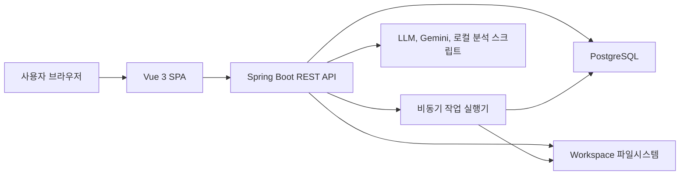

# Vue 3, Spring Boot, PostgreSQL 전환 설계

## 목표

현재 Node/Express 단일 서버와 `public/index.html` 중심 UI, JSON 파일 저장 방식을 Vue 3 프론트엔드, Spring Boot API 서버, PostgreSQL 영속 저장 구조로 전환한다.

## 현재 구조 요약

- 프론트엔드는 [public/index.html](/C:/ecams-ai-linux/public/index.html)에 HTML, CSS, JS가 크게 묶여 있다.
- 백엔드는 [server.js](/C:/ecams-ai-linux/server.js) 단일 Express 서버가 인증, 사용자, 레포, 권한, 채팅, 작업 큐, 파일 조회, 검색, 피드백, 푸시, 지식 관리 API를 처리한다.
- 주요 영속 데이터는 `users.json`, `repos.json`, `requests.json`, `companies.json`, `logs/chat_history/*.json`, `pushSubscriptions.json`, `answer_cache.json`, `knowledge/*.json`, `indexes/`, `wiki/` 등에 흩어져 있다.
- 실제 분석 대상 소스 파일과 인덱스, 위키, graphify 산출물은 파일시스템 의존이 강하므로 DB 전환 대상과 파일 유지 대상을 분리해야 한다.

## 권장 아키텍처

## 모듈 분리

- `frontend/`는 Vue 3, Vite, Pinia, Vue Router, TypeScript를 기본으로 둔다.
- `backend/`는 Spring Boot 3, Java 21, Spring Web, Spring Security, Spring Data JPA, Flyway, PostgreSQL Driver를 기본으로 둔다.
- `scripts/`, `knowledge/`, `wiki/`, `indexes/`, `workspace/`는 1차 전환에서는 파일시스템 산출물로 유지한다.
- Node 분석 빌더들은 바로 Java로 재작성하지 않고 Spring에서 프로세스로 호출하거나 별도 worker로 감싼다.

## DB 전환 범위

1차 DB 대상.
- 사용자, 회사, 레포 메타, 레포 권한.
- 가입 및 권한 요청.
- 채팅 세션과 메시지.
- 작업 큐 상태와 스트림 로그.
- 푸시 구독.
- 피드백.

1차 파일 유지 대상.
- 업로드된 레포 원본.
- 인덱스, 위키, graphify 산출물.
- 대형 캐시와 임베딩 원본.
- 임시 작업 로그.

## 핵심 테이블 초안

- `users`: id, password_hash, name, phone, affiliation, user_type, role, created_at, updated_at.
- `companies`: id, name, created_at, updated_at.
- `repositories`: id, name, path, company_id, type, created_by, created_at, updated_at.
- `user_repo_permissions`: user_id, repo_id, level.
- `user_company_permissions`: user_id, company_id, level.
- `access_requests`: id, type, user_id, repo_id, company_id, level, status, payload_json, created_at, decided_at.
- `chat_sessions`: id, user_id, title, deleted, updated_at.
- `chat_messages`: id, session_id, role, content, metadata_json, created_at.
- `jobs`: id, user_id, type, status, repo_ids, question, result_json, error_message, created_at, updated_at.
- `job_events`: id, job_id, seq, event_type, content, created_at.
- `push_subscriptions`: id, user_id, endpoint, p256dh, auth, created_at.
- `feedback`: id, user_id, chat_id, type, question, correction, repos_json, created_at.

## API 설계 원칙

- 기존 `/api/...` 경로는 가능한 유지해 Vue 전환과 백엔드 전환을 분리한다.
- 응답 JSON 형태도 1차에서는 최대한 유지한다.
- 인증은 1차에서 JWT Bearer로 유지하고, 이후 refresh token 또는 세션 쿠키를 검토한다.
- 파일 접근 API는 Spring에서 path traversal 방어를 명시적으로 구현한다.
- 채팅 작업 스트림은 기존 SSE 형태를 유지한다.

## 전환 단계

1. 설계 고정과 데이터 목록화.
2. PostgreSQL 스키마와 JSON 마이그레이션 도구 작성.
3. Spring Boot API 뼈대 생성 후 인증, 사용자, 회사, 레포 권한부터 이식.
4. 채팅 기록, 작업 큐, SSE, 피드백, 푸시 API 이식.
5. Vue 3 앱 생성 후 기존 화면을 라우트와 컴포넌트로 분해.
6. 파일 브라우저, 검색, 코드 뷰어, 채팅 UI 연결.
7. Docker Compose를 Spring Boot, Vue 정적 빌드, PostgreSQL 기준으로 갱신.
8. 병행 검증 후 Node 서버 제거 또는 worker 전용으로 축소.

## 예상 기간

작게 잡아도 2주 이상이다.

- 설계와 스키마, 마이그레이션 PoC는 1일에서 2일.
- Spring Boot API 1차 이식은 4일에서 7일.
- Vue 3 화면 분해와 연결은 4일에서 8일.
- 작업 큐, SSE, 파일 보안, 배포 검증까지 포함하면 2주에서 4주가 현실적이다.
- 기존 기능을 모두 보존하고 운영 데이터 마이그레이션까지 안전하게 하려면 4주 이상도 가능하다.

## 주요 리스크

- [server.js](/C:/ecams-ai-linux/server.js)가 약 3천 줄 규모라 기능 경계가 섞여 있다.
- [public/index.html](/C:/ecams-ai-linux/public/index.html)이 약 27만 자 규모라 Vue 컴포넌트 분해 비용이 크다.
- 현재 JSON 파일에 인코딩 깨짐 데이터가 섞여 있어 DB 마이그레이션 전에 정규화 기준이 필요하다.
- 분석 빌더와 파일시스템 산출물은 PostgreSQL로 무리하게 넣으면 성능과 복구가 나빠질 수 있다.

## 1차 성공 기준

- 기존 로그인, 사용자 관리, 회사 관리, 레포 권한 관리가 PostgreSQL 기반 Spring Boot API에서 동작한다.
- Vue 3 앱에서 기존 `/api` 계약으로 동일 기능을 사용할 수 있다.
- JSON 원본에서 PostgreSQL로 초기 마이그레이션이 재실행 가능하다.
- 기존 Node 서버와 신규 Spring 서버의 주요 API 응답을 비교할 수 있다.
